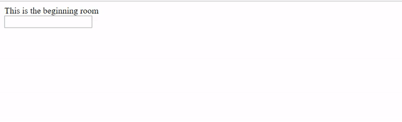

# Text RPG Engine

JS library in ES6 to create text adventures, or works of interactive fiction, with the ability to craft custom player interactions through "prompts", which comprise a game's commands. Lightweight (~51kb minified) and small (~400 lines of code).

Animated example demo



## Features

* Player can move through `rooms` (rooms can have `item` requirements)
* Inventory system
* Environment and item interactions through `prompts`
* Extreme flexibility; prompts can be anything and are stored in rooms, so prompts can have the same keyword triggers as long as they belong to different rooms

## Limitations

* User can only perform one prompt / command at a time
* There are no "common" prompt interactions; everything must be defined and repeated throughout different rooms if necessary

## Building the library

* `npm install` to get the project's dependencies
* `npm run build` to produce minified version of your library.

## Scripts

* `npm run build` - produces production version of your library under the `lib` folder
* `npm run dev` - produces development version of your library and runs a watcher
* `npm run build:example` - produces bundled example app (with Browserify) from /example/main.js

## Using the library API to create a game

```
// Add a room (by default will be beginning room since it was first added)
const startRoom = game.addRoom('Beginning', 'This is the beginning room');
// Add a second room (by default will be winning room since it was added last)
const endRoom = game.addRoom('SecondRoom', 'You did it! You won!');

// Add required item to room
endRoom.requirements.push('accessKey');

// Add room prompts
startRoom.addPrompt(
  // name of prompt (required)
  'go right',
  // keywords that will activate prompt (required)
  ['go right', 'move right', 'open right', 'enter right', 'door right', 'right door'],
  // results of prompt
  {
    // successful prompt result text (required)
    'successText': 'You enter in the access code "14052" and successfully open the door.',
    // failed prompt result text (optional)
    'failText': 'The door is locked with an access code!',
    // room to enter as result of prompt (optional)
    'roomToEnter': 'SecondRoom',
    // items added to inventory after successful prompt result (optional)
    'itemsGiven': 'trophy'
  },
  // required items to successfully do prompt
  ['accessKey']
);

startRoom.addPrompt(
  'look room',
  ['look room', 'look at room', 'search room', 'examine room', 'look in'],
  {
    'successText': 'You see a room with a door to the right and a statue in the middle.'
  }
);

startRoom.addPrompt(
  'get statue',
  ['get statue', 'pick up statue', 'take statue', 'pick statue'],
  {
    'successText': `You pick up the statue. It feels heavy in your hands, and there's something hanging off
                    the bottom.`,
    'itemsGiven': ['statue']
  }
);

startRoom.addPrompt(
  'rotate statue', 
  ['rotate statue', 'rotate the statue'],
  {
    'successText': 'You take the note from the bottom of the statue.',
    'failText': 'You have no statue to look at!',
    'itemsGiven': ['note']
  },
  ['statue']
);

startRoom.addPrompt(
  'look note',
  ['look at note', 'examine note', 'take note', 'get note', 'check note', 'read note', 'look note'],
  {
    'successText': 'You look at the note and find an access code: "14052."',
    'failText': 'You have no note to look at!',
    'itemsGiven': ['accessKey']
  },
  ['statue', 'note']
);

game.init();

```

## Loading game data from a JSON file

```
const game = require('./text-rpg-engine.min');

const path = require('path');
const fs = require('fs');

// Below code loads game data from static JSON file
let data = JSON.parse(fs.readFileSync(path.join(__dirname, './example.json')));

game.loadData(data);

game.init();
```

## Letting users play the game on the web

By default, the library looks for an input form element with the class `input`, and a div element with the class `display` for the game's input and display (these classnames can be remapped in the game's input and display properties). 

To link a game's backend to your webpage, include this in the script where the main game component is called / created:

```
// Send user input to our game (on pressing 'Enter' in the form)
document.getElementById('input').addEventListener('keypress', function (event) {
  if (event.keyCode === 13) {
    event.preventDefault();
    game.userSend(document.getElementById('input').value);
    document.getElementById('input').value = '';
  }
});
```

## Example files

An example game has been created in `/example`. The example `main.js` file loads game data from `example.json`, and also contains commented out code to build the same game programmatically. The example game is what you see in the GIF demo and what's been written in this README.

## Future

* Make game be able to parse user input for multiple prompts / commands
* Make game be able to interchange common words in prompt keywords (so developers won't have to repeat synonyms for keyword triggers)
* Add saving ability with different player names and scores (time it takes to solve game)
* Create GUI to automatically generate JSON game data files

## Credits

* [Start your own JavaScript library using webpack and ES6](http://krasimirtsonev.com/blog/article/javascript-library-starter-using-webpack-es6)
